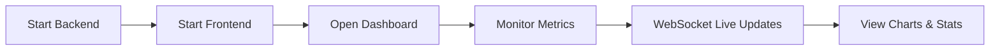

# TOON Analytics Dashboard

Real-time analytics dashboard for TOON compression performance monitoring.

**Note:** Always navigate to `toon\analytics` directory first before running any commands.

## Process Flow

## Quick Start

| Step | Command | Description |
|------|---------|-------------|
| 1 | `cd toon\analytics` | Navigate to analytics directory |
| 2 | `npx tsx server/index.ts` | Start Fastify backend server |
| 3 | `npx vite` | Start Vite development server |
| 4 | Open browser to URL shown | Access dashboard in browser |

## Features

- **Real-time metrics**: Compression ratios, encode/decode speeds, memory usage
- **WebSocket connection**: Live updates with automatic fallback to HTTP polling
- **Interactive charts**: Historical trends visualization
- **Connection status**: Visual indicator for connection health

## API Endpoints

- `GET /api/health` Server health check
- `GET /api/metrics` Current metrics snapshot
- `GET /api/history?minutes=60` Historical data
- `WS /ws` WebSocket for real-time updates

## Stopping

Press `Ctrl+C` in both terminal windows to stop the servers.

## Components

### Server (`server/`)

- **index.ts** Fastify server with WebSocket streaming
- **metrics.ts** Data collection and storage
- **performance.ts** TOON encoding/decoding benchmarks

## Testing

### Commands

| Command | Purpose |
|---------|---------|
| `npm run test` | CLI validation testing |
| `npm run test:quick` | Fast testing (2s intervals) |

### Dashboard Testing Steps

| Step | Command | Description |
|------|---------|-------------|
| 1 | `npx tsx server/index.ts` | Start backend server |
| 2 | `npx vite` | Start dashboard server |
| 3 | Open browser to URL shown | View real-time dashboard |
| 4 | `npm run test` | Generate test data |

### Validation

- Compression ratios: 2x to 3x expected
- WebSocket connection: "Live (WebSocket)" status
- Charts update smoothly
- No console errors
